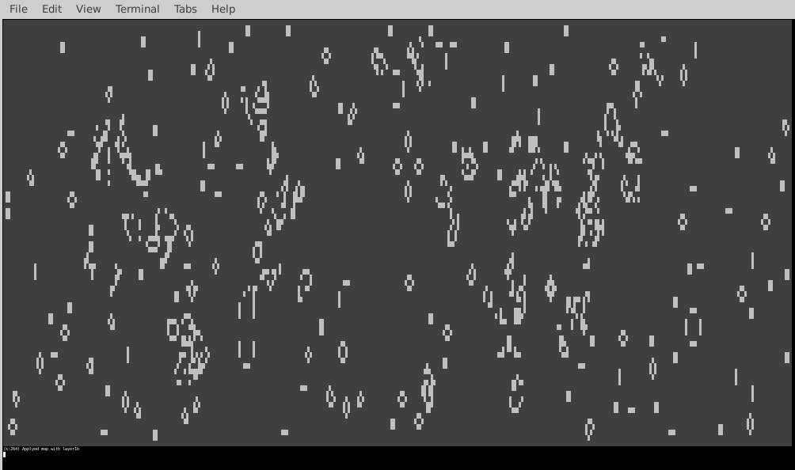

# Un-optimized-Java-Conway-s-Game-of-Life
Originally ProcidualGenerationTest1a, created for a project, no longer maintained. At current settings it acts as Conway's Game of Life. 

The code here is very messy, not at all documented, incompleate, and at the time of creating the repository is already years old. It is sloppy and I only made it a repository so it would be easyer to archive as something I did in my past.

Notes:
  - Tested on OpenJDK 11
  - To switch from the different modes, you need to manualy edit code by line #84 on WorldGenerator.java (just do ctrl+f "@@@").
